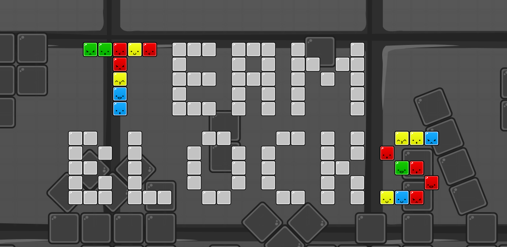

# Team Blocks

This is the source code to Team Blocks, a multiplayer version of the famous bricks game ;) The rules are simple:

1. Your blocks are blue.
2. Your partner's blocks are yellow.
3. Overlapping blocks turn green.
4. Completed green lines disappear.

Teamwork is the key to the top of the leaderboard! Available on the [Google Playstore](https://play.google.com/store/apps/details?id=org.faudroids.doublestacks).
